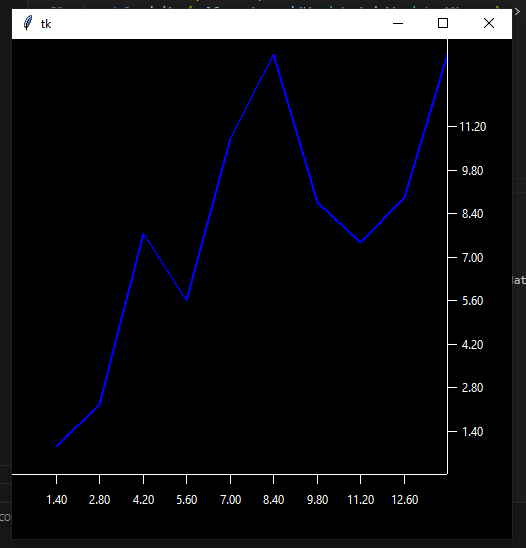

# Tkinter Charts
This package will provide a Frame containing a Canvas capable to draw simple charts.

The motivation behind this little project is to be able to use an easy and light way to draw charts in Tkinter, rather than use heavy package like matplotlib (which is a great package).

## Actual State : Iteration 1 (see [historic for past iterations](https://github.com/Morgiver/tk-charts/blob/main/iterations.md))
The main objective for this iteration is to correctly draw datas in the DataViewport.

### Objectives
1. Handle Datas in DataView, for now it will be only one set of datas.
2. Modify XScaleView to enabling the resizing of X axis scale
3. Modify YScaleView to enabling the resizing of Y axis scale
4. Inherit a new Class to handle a DatetimeYScaleView
5. Draw Line dataset
6. Draw Candlestick dataset
7. Draw Bar dataset
8. Build a widget that control the selection of data view type to choose between Line, Candle and Bar.

## Example image
